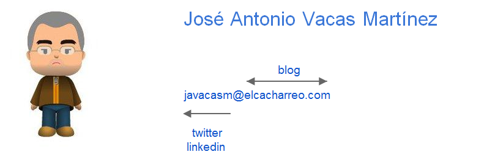

* FOC: Profesor de Programación C# y Android (2012-15)
* UGR: Profesor Arduino (2012-15)
* Responsable del Dpto de Desarrollo Smart-RTC y de análisis de Assyce Fotovoltaica (2008-2012)
* Analista Trevenque (2002-2008)
* Analista-Programador Meta4 (1998-2002)
* UGR: Profesor Física Estadística (1994-1998) 